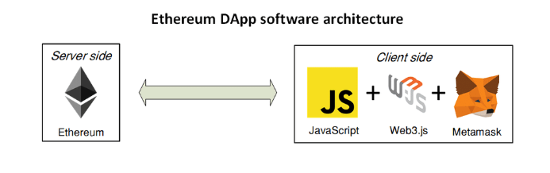
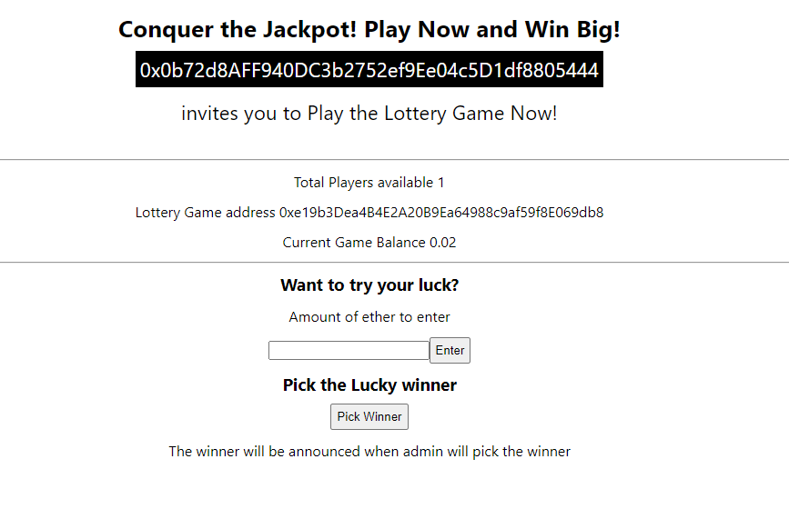

# `Full Stack Blockchain application with React, web3 and Ethereum` 

A Dapps (Decentralized Application) combines React, Web3, and Ethereum to create a new breed of applications. React is used to build the user interface, Web3 connects the front end to the Ethereum blockchain, and Ethereum provides a secure and decentralized back-end platform. This tech stack enables developers to create applications with enhanced security, transparency, and user control, leveraging the power of blockchain technology. 

## `Project Architecture Diagram`

## `setup project structure` 
Follow setting up the Project structure in a sequence, setup a react project first followed by a 
truffle project within the same directory
1.  create-react-app react-ethereum
2.  change to react-ethereum directory
3.  truffle init -y
4.  truffle create contract YourContractName # scaffold a contract
5.  truffle create test YourTestName         # scaffold a test if in case you have test cases 
6.  edit the truffle-config.js with the changes updated in the repository.  (it has changes related to the Goerli test network, an Ethereum network)
7.  npm i web3
8.  npm i @truffle/hdwallet-provider

## `Infura Signup and MetaMask Wallet`
This project will required a browser extension of MetaMask, which is a cryptocurrency wallet and allows you to manage your Ethereum accounts, sign transactions, and interact with smart contracts.

To use Infura with Metamask, you can create an Infura account and obtain an API key or project ID. This ID acts as a credential to access the Infura service. You can then configure Metamask to connect to the Ethereum network via Infura by specifying the network URL provided by Infura, along with your API key or project ID.

## `Web3 and HDWalletProvider`
Web3 acts as the middleware bridge between the front-end application and the Ethereum blockchain. It allows the dApp to connect to an Ethereum node, send transactions, and retrieve information from the blockchain.

HDWalletProvider is a provider for web3.js that allows you to connect to an Ethereum network using a mnemonic phrase or a JSON wallet file. It is commonly used in development environments or when deploying smart contracts to an Ethereum network.

### `npm start`

Runs the app in the development mode.\
Open [http://localhost:3000](http://localhost:3000) to view it in your browser.

The page will reload when you make changes.\
You may also see any lint errors in the console.

### `npm test`

Launches the test runner in the interactive watch mode.\
See the section about [running tests](https://facebook.github.io/create-react-app/docs/running-tests) for more information.

### `npm run build`

Builds the app for production to the `build` folder.\
It correctly bundles React in production mode and optimizes the build for the best performance.

The build is minified and the filenames include the hashes.\
Your app is ready to be deployed!

See the section about [deployment](https://facebook.github.io/create-react-app/docs/deployment) for more information.

### `npm run eject`

**Note: this is a one-way operation. Once you `eject`, you can't go back!**

If you aren't satisfied with the build tool and configuration choices, you can `eject` at any time. This command will remove the single build dependency from your project.

Instead, it will copy all the configuration files and the transitive dependencies (webpack, Babel, ESLint, etc) right into your project so you have full control over them. All of the commands except `eject` will still work, but they will point to the copied scripts so you can tweak them. At this point you're on your own.

You don't have to ever use `eject`. The curated feature set is suitable for small and middle deployments, and you shouldn't feel obligated to use this feature. However we understand that this tool wouldn't be useful if you couldn't customize it when you are ready for it.

## `dApp output display`
